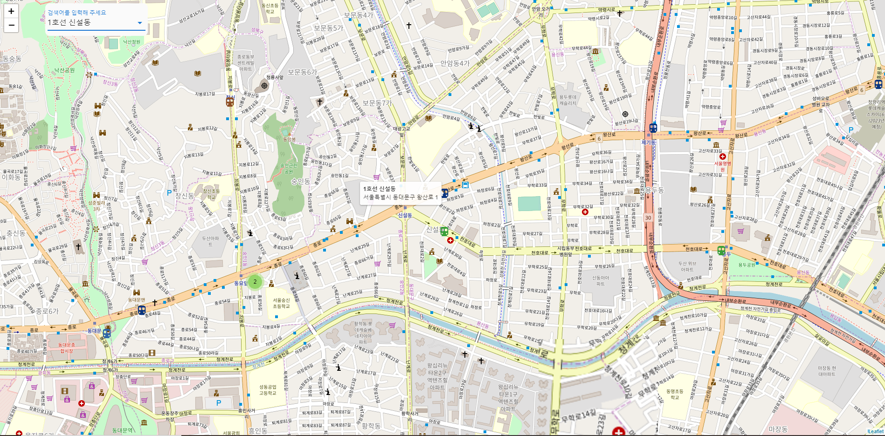
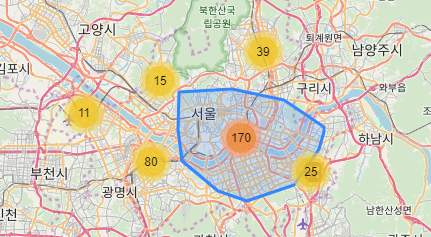

# Seoul SubwayMap using Leaflet

leaflet.js를 이용한 서울 지하철 지도를 시각화고 지도 위에 자동완성 검색 바를 만드는 것이 목표였습니다.
또한, leaflet.markercluster plugin 을사용하여 마커 클러스터링 구현하는 것까지 목표로 삼았습니다.

## 구현 방법
Leaflet.js를 사용하여 페이지에 지도를 시각화하였습니다.
자료로 주신 서울 지하철 위경도 엑셀 파일을 JSON파일로 변환하여 해당 위치에 지하철 아이콘을 표시하였습니다. 아이콘을 클릭하면 몇 호선의 어느 지하철인지 ToolTip으로 표시를 할 수 있게끔 구현을 하였습니다.
또한, Vuetify를 사용하여 auto complete 검색 바를 만들어 더욱 쉽게 검색할 수 있도록 하였습니다.
VueX를 활용하여 Map 과 SearchBar 컴포넌트의 데이터 통신을 좀 더 간편하게 하였습니다.
leaflet의 내장 메소드인 flyTo를 사용하여, 검색 바를 통하여, 이동하고 싶은 지역을 검색했을 때, 그 지역으로 지도의 위치를 바꾸는 것을 구현하였습니다.
leaflet.markercluster plugin을 사용하여 지도위에 커서를 가져다 놓았을 때, 그 지역의 지하철 영역이 표시되게끔 하였습니다.
또한, 스크립트들을 view와 components로 구분하여 개발하였습니다.

## 어려웠던 점
처음 leaflet을 사용하여 지도를 시각화하는 것이 가장 어려웠습니다. 지도가 잘리거나 아예 표시되지 않기도 하여 가장 헤맸고 어려웠던 부분이라고 생각됩니다. 또한, 지도위에 아이콘을 커스텀하는 단계에서 이미지를 URL이 아닌 로컬 파일을 가져와 사용하는 부분에서 조금 헤매기도 하였습니다.
마커 클러스터링을 구현하는 부분에서 약간의 어려움을 느낀 것 같습니다. 하지만 leaflet공식 문서와 구글에 마커 클러스터링을 검색하여, 크게 어렵지 않게 구현을 하였습니다.

## 추후 수정 및 개선 점
마커 클러스터링 기능을 사용할 때 아이콘이 잘 사라지지 않는 현상을 고쳐야 할 것 같습니다.
라우터가 제대로 적용되지 않아 처음에 보이는 컴포넌트가 라우터에 설정해놓은 컴포넌트가 아닌 App컴포넌트가 보이는 부분을 수정을 해야 할 것 같습니다.

(2019.11.19 전체 수정)